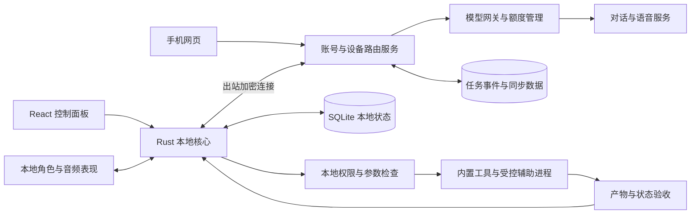

# 桌面 AI 伙伴：技术可行性与首版架构分析

> 分析日期：2026 年 9 月 13 日。针对“有完整角色形态、能够相处与办事、可通过手机接续的桌面伙伴”，不限定 SRE 或图谱。判断依据为官方技术文档与工程分析；尚未构建本项目的 Tauri 客户端，也未获得真实性能、模型质量或运行成本数据。

执行层已形成[敏捷阶段门计划](../planning/agile-stage-gate-plan.md)及[待办验收矩阵](../planning/delivery-backlog.md)：v1.1 保留16周为原始挑战目标，按完整工作与角色容量给出28周资源排布示例；独立感知/硬件增量，商业评审等待实际付费周期。执行计划中的门槛是待评审基线，未表示已通过。

**结论：限定范围的商业首版技术可行。建议采用 React + TypeScript + Tauri 2 + Rust，角色在本地渲染，对话与主要推理使用云服务，本地执行明确的工具动作，手机先提供网页交办与查看。Wasm/WASI 暂不作为主架构必选项。**

首版的关键不是再训练一个大模型，而是把角色、语音、记忆、任务和设备状态组织成稳定的产品。最影响交付和利润的是常驻资源占用、语音延迟与费用、记忆质量、工具失败恢复，以及多设备状态一致性。

## 1. 可行性应按具体承诺判断

| 用户可感知能力 | 判断 | 可以作出的首版承诺 | 仍需实测的部分 |
|---|---|---|---|
| 桌面角色、动作、表情、拖动、收起 | 高度可实现 | 一名制作完整的角色在 Windows 桌面相处 | 多屏、缩放、点击穿透、全屏场景、资源占用 |
| 中文文字交流、角色口吻 | 可实现 | 在限定主题与模型版本下保持角色表达 | 长对话一致性、模型升级漂移、网络超时 |
| 流式语音与说话口型 | 可实现，体验需打磨 | 按键说话、流式回复、随时停声 | 噪声、回声、语音端点判断、首段延迟 |
| 记住偏好与共同经历 | 可实现，但不是无限正确记忆 | 记住经确认的信息，支持查看、更正、删除 | 误记、过期事实、检索错误、跨端冲突 |
| 帮忙处理文件与少量应用任务 | 限定范围可实现 | 指定工具、明确范围、展示成果与状态 | 各工具前置条件、验收、重复执行与失败恢复 |
| 手机交办，电脑执行 | 可实现 | 电脑在线且执行器可用时交办；否则排队或提示 | 断线、休眠、会话锁定、撤销、重复消息 |
| 手机与电脑保持同一伙伴身份 | 可实现 | 同步角色版本、允许同步的记忆、对话和任务 | 冲突解决、语音焦点、附件可达性 |
| 自动操作任意软件 | 技术可演示，不能承诺普遍可靠 | 仅对已适配场景开放 | UI 变化、权限、弹窗、焦点及动作误差 |
| 所有电脑完全离线且达到云端体验 | 不能统一承诺 | 后续提供硬件分级的本地模式 | 设备差异、模型质量、内存与显卡竞争 |
| 全天观察、无限语音、跨所有设备自主工作 | 不宜作为首版承诺 | 分开提供有开关、有额度、有状态的能力 | 成本、系统限制、体验与可靠性共同约束 |

这些判断描述工程成熟度，不是本项目已经通过的验收结果。

## 2. 推荐技术栈：每项技术都对应一个明确职责

| 组成 | 建议 | 原因与边界 |
|---|---|---|
| 页面与交互 | React + TypeScript + Vite | 负责聊天、设置、任务卡、手机网页；不承担高权限执行 |
| 桌面宿主 | Tauri 2 | 负责窗口、托盘、IPC、安装与更新；Windows 优先验证 |
| 本地核心 | Rust + 异步运行时 | 负责设备连接、任务状态、文件工具、权限校验、数据库、音频或原生适配 |
| 角色表现 | 首版选一种渲染路线 | 默认评估 Live2D；如产品强调三维动作则采用 Three.js + VRM，不同时做两套 |
| 本地数据 | SQLite | 对话缓存、记忆、执行日志、待同步事件；由 Rust 统一访问 |
| 云端服务 | 小型模块化单体 | Rust 团队可用 Axum/Tokio；若团队主要熟悉 TS，云端用 TS 也成立，避免为统一语言增加交付成本 |
| 云端持久化 | PostgreSQL + 对象存储 | 保存账号、设备、任务事件、额度账本及已允许上传的附件；不与本地数据库直接做文件级同步 |
| 模型 | 云端模型与语音适配层 | 初期一家主供应商，保留适配接口；在验证之后加入备选，不随机切换人物声线与行为 |
| 手机入口 | 响应式网页，必要时再原生化 | 先支持交办、确认、结果和会话接续；不承诺网页在后台常驻监听 |
| Wasm/WASI | 暂缓自建插件运行时 | 存在具体计算或插件隔离需求时再引入 |

### 2.1 Tauri 能做，但“小安装包”不是“低资源占用”的保证

Tauri 使用 Rust 核心进程和 WebView 进程。Windows 使用 WebView2，macOS 使用 WKWebView，Linux 使用 WebKitGTK；通常不把完整 WebView 引擎随应用一起打包。这支持 React 与原生能力组合，也意味着目标平台的 WebView 行为需要分别验证。[Tauri 进程模型](https://v2.tauri.app/concept/process-model/)

人物纹理、动画、渲染上下文、语音缓冲和本地模型才可能成为大头。不能由 Rust 或安装包体积推导“内存只有几十 MB”。测量要统计宿主及其关联 WebView/渲染进程，并说明共享进程的归属方法。

推荐两个按需窗口：常驻角色窗口和打开时才创建的控制面板。角色位置与动画循环在本地直接更新；React 不必每帧更新整棵页面树，Rust IPC 也不必逐帧传递骨骼或嘴型参数。

Tauri 提供窗口级忽略鼠标事件等 API，但透明背景不自动等于“只有人物轮廓可以点击”。精细命中需要结合渲染层命中判断与平台窗口行为验证；首版可先用紧凑窗口和明确的交互/穿透切换，避免让透明矩形挡住工作区域。[Tauri 窗口 API](https://v2.tauri.app/reference/javascript/api/namespacewindow/)

### 2.2 Electron 是交付备选，不必为了 Rust 排除它

Electron 有主进程、渲染进程及 Node.js 生态，适合已有大量 Node SDK、浏览器自动化依赖和相关经验的团队。[Electron 进程模型](https://www.electronjs.org/docs/latest/tutorial/process-model)

当前优先 Tauri 的前提是团队能维护 Rust 和必要的 Windows 原生适配。如果这些能力缺失，而主要工作都依赖 Node，Electron 可能降低人员与集成成本。应使用同一角色资产、同一帧率和同一语音负载比较，不能拿空白 Tauri 窗口与完整 Electron 产品比较资源占用。

Tauri 也可以挂辅助进程，但辅助进程会带来打包、进程管理、IPC 和升级成本。首版只在浏览器工具或本地模型确实需要时增加，避免把多个运行时都作为默认依赖。

### 2.3 Wasm 和 WASI 到底要不要

| 技术 | 能解决什么 | 不能代替什么 | 本项目时机 |
|---|---|---|---|
| 浏览器 Wasm | 某些模型推理、音频处理、解析或跨语言计算模块 | 桌面窗口、设备同步、Agent 决策质量 | 使用的第三方库可能已内置；无需为技术栈完整而重写业务 |
| Rust 编译到 Wasm | 把适合的纯计算逻辑复用到网页 | Rust 本地系统调用不会自动变成网页能力 | 确认某块逻辑需要跨端且有收益后再用 |
| WASI + Wasmtime | 为非浏览器 Wasm 模块提供宿主接口及受限执行环境 | 完整 Windows API、所有 Python/Node 包、自动权限管理 | 开放第三方可执行插件后再评估 |

WASI 是一组系统接口，运行范围由宿主实现与授权决定；Wasmtime 的文件访问遵循能力模型。CPU 时间、内存、可访问目录、网络及宿主函数仍需要逐项限制。若宿主暴露了无范围检查的 `execute_shell`，不能因为外层是 Wasm 就宣称安全。[WASI 简介](https://wasi.dev/)、[Wasmtime 安全模型](https://docs.wasmtime.dev/security.html)

首版用受控、内置、类型化的工具函数即可。Wasm/WASI 不负责“伙伴在设备间跳转”；后者是身份、数据和任务同步问题。

## 3. 数字人形态：表现系统要独立于语言模型

### 3.1 角色路线选择

| 路线 | 适合形态 | 主要工程与成本 |
|---|---|---|
| 2D 骨骼或精灵 | 抽象宠物、轻量风格、少量固定动作 | 实现相对可控；表现上限依赖资产与动画设计 |
| Live2D | 二次元人物、细腻表情、上半身交流 | 原画拆分、绑定、动作与表情制作；需要明确 SDK 和资产商业使用范围 |
| Three.js + VRM | 三维人物、视角变化、全身姿态 | 材质、骨骼、动作融合、裁剪与性能分级；角色资源本身有独立许可 |
| 实时生成视频人物 | 摄影式数字人 | 需要专门验证稳定性、延迟、连续性与持续生成成本，首版不采用 |

Live2D 官方 SDK 提供 Web 版本和嘴部参数控制能力，可以将播放音频驱动为嘴型动画。[Live2D SDK](https://www.live2d.com/en/sdk/about/)、[口型控制文档](https://docs.live2d.com/en/cubism-sdk-manual/lipsync/)

如果选择 Live2D，不能把“小团队”直接等同于所有商业发布免费。其官方条款对可扩展应用有单独安排；支持用户导入任意模型等设计是否落入该类别，要在采用前确认，否则授权会影响成本和发布进度。[Live2D 发布许可](https://www.live2d.com/en/sdk/license/)

Three.js 的 VRM 接入可使用 `@pixiv/three-vrm`，该库标明 MIT 许可；这不授予导入角色的形象、声音或模型资产商业权利。[three-vrm 官方仓库](https://github.com/pixiv/three-vrm)

**本项目默认：先制作一名完整的风格化角色，选择 Live2D 或 VRM 中的一种，不先建设任意模型导入平台。** 角色是否有吸引力依赖设计、绑定、动作和声音，不由 Rust、Wasm 或模型参数规模决定。

### 3.2 三种状态不要混在一起

```text
交互状态：待机 / 倾听 / 思考 / 说话 / 被打断
表现意图：平静 / 好奇 / 高兴 / 关切等有限枚举
任务事实：等待授权 / 执行中 / 待核验 / 完成 / 失败 / 结果未知
```

模型可以在约束范围内建议表现意图，由客户端映射为已有动作；呼吸、眨眼、待机变化由本地规则控制。任务事实只来自执行系统，不能因为人物说“好了”就标记任务完成。

动画需要优先级：说话嘴型覆盖待机嘴型，用户拖动暂时中止自动位移，暂停或收起降低更新频率。情绪变化要有过渡和冷却，避免模型每句话给出不同标签导致人物抽动。

口型以实际播放的音频时间为基准，而不是以收到文本的时间为基准。第一版可做音量驱动的嘴部开合；精细音素嘴型需要语音时间戳或额外对齐能力，不能把二者视为同样效果。

主动互动先由任务完成、用户设定时间和明确活动事件触发。一直请求云模型决定“要不要说话”会增加费用和打扰，并不是角色有生命感的必要条件。

## 4. 推荐架构与一条完整交互链



推荐云端承载账号、模型凭据、计费和设备消息路由；本地执行器负责它实际能访问的资源。云端发送的是具名任务意图和参数，不直接拥有电脑任意文件与命令执行权。

以“用电脑上的三份资料整理明天的讲稿”为例：

1. 用户在电脑选定允许使用的文件；手机交办时引用已经授权的资料集合。
2. 服务确定执行设备、允许的模型输入范围、任务预算与输出位置。
3. 本地执行器读取资料。需要云推理时，仅按该任务范围提交内容；若资料不允许离开本机，使用已配置的本地能力或说明无法完成。
4. 模型提出提纲或结构化工具调用，参数经过宿主检查后执行。
5. 输出写入新草稿，验收文件存在、可读和结构条件；内容准确性按任务要求另行核验，文件存在本身不代表内容正确。
6. 任务完成事件持久化，并同步到手机；人物据此表达完成状态。

UI 负责呈现，Rust 负责本地执行和范围，云端负责路由与服务。这个分工可避免角色窗口崩溃直接丢失任务进度。

## 5. 语音：接口已具备，延迟、打断与费用需要产品工程

### 5.1 两条实现路线

**首版建议：流式 ASR → 文本模型 → 流式 TTS。** 优点是识别结果可见、角色文本可控、工具调用容易隔离、供应商可替换；代价是多个环节的延迟需要管理。

后续可比较端到端实时语音模型，对话自然度可能改善，但声音控制、文本对应、工具能力、限流和计费都应按具体模型评估。不能仅根据端到端架构宣称更快。阿里云官方提供实时多模态模型及流式 TTS 接口，说明相关基础能力已可接入；具体质量与地区可用性仍需按选用版本测试。[Qwen-Omni 实时接口](https://help.aliyun.com/zh/model-studio/realtime)、[实时 TTS](https://help.aliyun.com/zh/model-studio/realtime-tts-user-guide)

### 5.2 首版交互方式

- 先做按键说话与明确麦克风状态，随后加入免按键语音活动检测。
- 文本分句达到可播放长度后提交 TTS，不必等待整段回答完成；分句过短也会损害语调和增加请求次数。
- 每轮回答附带生成 ID。用户打断后取消相应生成、清空待播放缓冲，并丢弃迟到的旧音频片段。
- 停止说话、停止模型生成、取消工具任务是三个不同动作；取消工具任务不代表已经发生的外部动作被撤销。
- 扬声器场景需检查回声处理，避免人物把自己的声音识别成用户。WebView 音频链达不到要求时，再评估 Rust/原生音频模块。

第一句本地“收到”或人物点头可以快速反馈，但验收时必须单独统计实际语义回复延迟，不能用预录反馈掩盖模型等待。

## 6. 记忆：可维护的信息系统，而不是无限拼接聊天记录

### 6.1 建议数据结构

| 信息 | 最小字段与处理 |
|---|---|
| 用户明确偏好 | 内容、用户来源、确认时间、适用范围、版本 |
| 共同经历 | 时间、活动、事件摘要、原始对话或任务引用 |
| 任务事实 | 工具观察、产物、时间与校验状态；和模型猜测分开 |
| 模型推测 | 标为候选，不直接写成用户事实 |
| 删除与更正 | 原记录 ID、修订版本、删除标记与同步状态 |

先使用结构化查询、近期事件和可解释的文本检索。确实需要语义查找后再添加向量检索；图数据库不是维持伙伴身份的前提。若使用全文检索，需要专门处理中文检索效果，不能默认英文分词方案可直接复用。

本地 SQLite 适合状态与记录；通过单一数据访问层协调写入。WAL 可以改善读写并发，但不是任意数量写者可同时写入的承诺。[SQLite WAL 文档](https://www.sqlite.org/wal.html)

上下文由“角色规范＋当前活动＋少量相关记忆＋最近对话”组成。历史更多不必意味着每次提示词更长；摘要也不是无损事实，需要保留来源和更正路径。

跨端同步使用对象 ID、版本及删除标记。更正或删除要覆盖检索索引、摘要和允许同步的副本；否则原始记录删了，旧记忆仍可能被召回。

### 6.2 角色连续性需要版本管理

对角色设定、声音、动作映射、提示词和模型版本分别记录版本。模型更换前，用固定的典型对话检查称呼、行为边界、表达方式、记忆引用和任务事实一致性。故障切换时应有稳定降级表现，不能每次重试变成另一种口吻。

## 7. 实际办事：最可行的是有限工具，不是万能鼠标手

推荐顺序为：应用 API／文件格式操作 → 受控浏览器适配 → Windows UI Automation → 必要时视觉定位与鼠标键盘。越接近屏幕坐标，越需要针对应用版本和环境验证。

| 首版工具候选 | 执行范围 | 可检查结果 |
|---|---|---|
| 读取并整理选定资料 | 用户选择的目录或文件集合 | 引用来源、草稿内容、输出文件 |
| 生成笔记与计划草稿 | 应用自己的工作目录 | 文件可读、格式与条目满足要求 |
| 设定提醒与专注活动 | 本应用内 | 提醒记录、时区和触发状态 |
| 查找近期任务与产物 | 本产品自己的记录 | 对应任务和产物确实存在 |
| 对一个已适配网站生成草稿 | 明确站点、账号与操作 | 表单或草稿状态；对外提交单独处理 |

第一版可以只实现前三至四项，确保有完整使用价值。用户已有明确范围授权时可以继续执行，不必每一步弹窗；对新范围或高影响动作再要求具体确认，避免把产品做成审批弹窗集合。

工具接口应包含类型、参数约束、资源范围、超时、预算、可取消性、幂等说明与验收方式。模型给出工具名称不代表它获得了权限。

Tauri capabilities 可以限制窗口能够调用的本地接口，但它不等于操作系统沙箱，也不能替代 Rust 命令内部的路径和参数校验。远程页面默认不应获得本地高权限命令；模型生成的 Markdown、网页和工具结果都按内容处理。[Tauri capabilities](https://v2.tauri.app/security/capabilities/)

Windows 自动化还受进程权限与桌面会话影响。普通助手不能假定可以驱动提权应用；有关 UIAccess 的平台机制也不能视为“随意控制所有窗口”的许可证。[微软 UI 自动化权限说明](https://learn.microsoft.com/en-us/power-automate/desktop-flows/how-to/enable-ui-access)

### 7.1 MCP 和 A2A 的位置

MCP 适合接入外部工具与资源；授权规范不代替本产品对任务、资源和费用的判断。首版选少量经过维护的连接器即可，不开放任意来源服务自动获得电脑权限。[MCP 授权规范](https://modelcontextprotocol.io/specification/2025-11-25/basic/authorization)

A2A 提供与外部 Agent 交换任务的协议基础。只有产品需要对接外部 Agent 时再采用；内部第一版可以先定义自己的任务事件结构。[A2A 任务生命周期](https://a2a-protocol.org/latest/topics/life-of-a-task/)

两种协议都不需要为了技术栈完整而加入。接入更多 Agent 不自动改善可靠性，反而增加版本、认证和故障来源。

## 8. 手机控制电脑与伙伴接续

### 8.1 可实现的连接方式

电脑执行器主动建立到服务端的加密长连接，手机通过账号和配对关系发送任务。无需让用户在路由器上暴露电脑端口。首版提供交办与结果同步；实时远程桌面视频属于另一种带宽、交互与权限需求，不作为必选能力。

设备状态至少区分：在线可执行、在线但会话不适合 GUI 操作、离线、已撤销。文件或 API 工具在某些锁屏状态仍可能工作，GUI 工具则必须检查当前交互桌面条件，不能统一按“电脑在线”处理。

电脑休眠时本地任务通常不能继续。云端可以执行已有访问条件的云任务；本机独有文件任务等待电脑恢复。不能在用户未选择上传的情况下，为保持“无缝”擅自把资料迁到云端。

手机主要负责输入、确认、查看与通知。Android 对后台任务及前台服务有约束，iOS 的后台运行也由系统管理，所以手机不能作为通用、无限后台运行的执行器。[Android 后台任务](https://developer.android.com/develop/background-work/background-tasks)、[Apple 后台策略](https://developer.apple.com/documentation/backgroundtasks/choosing-background-strategies-for-your-app)

### 8.2 同步的是身份和状态，不是移动一个进程

共享账号下，角色 ID、角色版本、允许同步的记忆、任务事件和对话游标可以跨端连续。Windows 文件路径、窗口句柄、GPU 状态和正在播放的音频缓冲不具有直接跨设备意义。

手机可展示简化同一角色，通过会话焦点租约确定当前主要发声设备；另一端保持静默提示。离线时回退为本地状态，不假装已同步。原生手机应用只在推送、音频或系统集成需求超过网页能力后安排。

### 8.3 任务恢复必须先于“自动重试一切”

建议任务状态：

```text
已创建 → 等待设备 / 等待授权 → 执行中 → 待验收 → 已完成
                                  ↓
                         失败 / 取消请求 / 结果未知
```

每个任务有 `task_id`，每次尝试有 `attempt_id`，每个有副作用动作有 `action_id`。持久化事件，设备重连时按序号补齐；使用执行租约和递增版本避免两个设备同时接管同一动作。

消息可以重复投递，执行器要去重。能够原子绑定动作和去重记录的本地工具可获得较强保证；外部 API 若不支持幂等键，进程在动作完成但回执丢失时只能先查状态。无法查询时标为“结果未知”，不盲目重发。

因此不承诺所有跨应用操作严格只执行一次，也不把任务取消当成事务回滚。这是远程办事产品必须处理的基本故障情况。

### 8.4 账号、资源归属与授权撤销（v1.1）

2026-09-22按用户选择改为自有邮箱验证码和服务端不透明会话；已完成的后端子项及限制见[自有账号服务](../status/coordinator-auth-api.md)。当前受邀登录使用SMTP投递，24小时绝对/30分钟闲置期限，到期重新验证；不引入密码找回或刷新令牌。丢失邮箱的人工恢复仍属待设计流程，未核实前不得转移数据。用户可以退出当前会话或全部会话，全部退出还作废未用验证码。T41原托管方案的人日估算需重新评估邮件运维、滥用防护、安全评审及恢复成本，不能沿用为自研交付承诺。会话有效也不等于副作用持续获准。

后端从已验证会话取得账号ID，任务、附件、记忆、导出、账本按owner逐次校验；不得信任客户端传入的user_id。对象存储使用带范围和短有效期的下载凭据；撤销后的新下载签发被拒绝，已发下载凭据存在明确有效窗口，已下载副本不能追回。生产与测试账号/存储/密钥隔离。首版云端采用模块化服务、持久队列、数据库及对象存储；部署、监测和备份有T43/T47独立责任。

授权分四层：账号会话、配对设备、资源/工具范围、单个任务。任务执行租约用于避免两个执行器争抢，**不能替代授权校验**。远程任务携带 account_id、origin_session_id、origin_device_id、executor_device_id、task_id、scope_id、对应auth_epoch、expires_at；会话ID是关联标识，不携带原始登录凭据。账号全部退出、设备撤销、资料收回、任务取消更新各自服务端版本/状态。

首版采用在线动作准入：每个远程工具动作（含读取或上传资料）开始前，执行器向服务端申请一次绑定action_id/参数摘要/授权版本的短期准入凭据。服务端在同一权威事务序列中核对当前会话、设备、资源与任务状态，并登记动作准入；候选凭据有效期5秒、单次消费。过期或无网络时暂停，不凭旧队列消息离线开始远程动作；本地用户另行授权的离线提醒等沿独立本地策略运行。

撤销事务提交是阻止**新准入**的分界。先于撤销获准的动作属于在途，即使尚在5秒启动窗口内，也可能已开始；撤销应发停止信号，执行器在收到撤销或下一个可取消边界停止。客户端分别显示“撤销已登记”“在途动作正在停止”“已停止/结果未知”，不能以撤销HTTP成功宣称所有设备已停。离线设备最多存在已授予的短启动窗口及已运行动作；这不等同5秒内一切副作用结束。

| 情况 | 执行与用户可见结果 |
|---|---|
| 排队后撤销 | 新准入检查失败，取消/拒绝；不执行旧队列任务 |
| 执行中撤销 | 尽力取消当前动作，禁止下一动作；已完成产物如实保留，不伪称回滚 |
| 不可取消调用或回执丢失 | 核对外部/本地结果；无法确认则结果未知，不自动重发 |
| 离线后重连 | 先刷新撤销版本和删除标记，再处理队列；过期任务需重新交办 |
| 旧消息或凭据重放 | auth_epoch/期限/动作摘要/消费记录不符即拒绝；完成动作按幂等记录返回结果 |
| 授权与撤销竞争 | 以服务端事务次序判准入先后；记录已获准在途动作，测试两种顺序 |

G3负测包括两个账号交叉读取/修改四类资源、过期/退出凭据、上述所有撤销情形。恢复备份后先禁止执行，核对最新授权、删除、账本和动作记录；缺失最新授权事实时使旧会话/授权失效并要求重新验证，不能从旧备份复活权限。该设计限制不能自动撤回已发生的外部副作用，须在交办说明和日志中一致呈现。

## 9. 本地模型与云模型：首版采用本地表现、云端智能

角色渲染、基本待机、窗口交互、提醒、数据缓存和部分工具在本地运行。云端提供主要对话和语音。断网时保留本地相处与已有记录，清楚显示在线能力暂不可用。

本地推理已有可用实现，例如 llama.cpp 支持多种硬件后端和量化模型；它证明部署路径存在，不证明所有目标电脑都能顺畅运行选定模型。[llama.cpp 官方仓库](https://github.com/ggml-org/llama.cpp)

理论上，70 亿参数按每参数 4 bit 存放，裸权重约 3.5 GB；实际还要加量化元数据、KV 缓存、运行时及计算缓冲。模型、上下文和并发不同，实际占用不同。不能仅以权重文件大小承诺显存需求或响应速度。

本地大模型还会与游戏、视频工具和人物渲染争用 GPU/内存。因此本地模式应作为硬件分级、明确模型版本的可选项，不能因其减少服务端调用就认定总交付成本更低；安装失败与设备兼容支持也有成本。

初期不训练基础模型，不默认微调。先用角色规范、记忆检索和输出约束达到可接受效果；仅当评测证明稳定缺口且有合适数据时再评估微调。

## 10. 性能、容量与成本必须同时验收

### 10.1 建议目标，不是已测成绩

先约定测试设备：Windows 11、16 GB 内存、中档集成显卡、1080p 单屏及双屏混合缩放；再补一档低性能设备。记录具体 CPU/GPU、驱动、WebView2 版本、角色资产与网络条件。

| 指标 | 首轮工程目标建议 | 测量口径 |
|---|---|---|
| 角色直接操作反馈 | P95 不超过 100 ms | 点击/拖动输入到可见反馈，排除云请求 |
| 活动角色动画 | 以 30 FPS 为默认档 | 报告帧时间与卡顿；隐藏、静止时降频或停帧 |
| 无本地大模型常驻内存 | 初步预算 300～500 MB | 宿主、关联 WebView 与渲染进程；实际资产测试后锁定 |
| 安静待机 CPU | 参考设备平均不高于约 2% | 全系统 CPU 百分比口径、连续观察；GPU 与功耗另测 |
| 首段语义语音 | P50≤1.5 s，P95≤3 s 的候选目标 | 用户说完到首次真正回答的可听音频，含端点判断与网络 |
| 本地打断停声 | P95≤200 ms 的候选目标 | 打断事件到本地停止发声，测迟到片段是否再次播放 |
| 在线手机提交后的任务接收提示 | P95≤2 s 的候选目标 | 不等同任务完成；按网络条件分组 |
| 工具结果 | 明确成功、失败、未知 | 对每类工具单独测，不能用聊天满意度代替 |

这些指标需要通过原型确定是否现实。当前没有任何数据支持已达标。若声画效果与占用冲突，应采用质量档、降低物理模拟或优化资产；不能直接把超标解释为用户设备问题。

### 10.2 几千名付费用户不等于几千个同时推理请求

容量演算示例：2,700 名活跃付费用户、每人每天 20 次交互，对应每天 54,000 次交互，平均每秒约 0.625 次。若一次占用模型连接 10 秒，则均匀情况下平均在途约 6.25 个；用 10 倍峰值作情景压力，约为 63 个在途连接。

这是未测的容量假设，不是服务端规格建议。一次交互可能触发多次模型与语音请求；高峰、免费用户、重试、长上下文和任务链都要另外计入。需要同时检查供应商 RPM、TPM、语音并发、连接数与账户额度。

架构上，初期可用模块化单体加持久任务队列，不以 Kubernetes、Kafka 或大量微服务作为前置。数据库、应用实例数量和容灾方式按实际吞吐与可接受恢复时间决定，而非按注册用户数猜服务器配置。

### 10.3 把此前每用户 25 元成本假设变成可测预算

| 月变动成本项目 | 每付费用户的预算占位 |
|---|---:|
| 对话与记忆处理 | 8 元 |
| ASR/TTS 语音 | 7 元 |
| 工具调用、失败与重试 | 3 元 |
| 按量存储、同步与网络 | 2 元 |
| 免费用户消耗及按量支持分摊 | 5 元 |
| 合计 | 25 元 |

这是拆分此前商业假设的预算，不是供应商报价，也没有证明这笔预算可以交付承诺体验。固定基础设施、人力与角色制作仍归固定成本，不能漏算或重复分摊。

语音预算尤其需要由时长反推。假设实测全链路语音成本为每分钟 r 元，每月语音预算为 7 元，则可支持时长约为 7÷r 分钟；若 r=0.05 元只能支持约 140 分钟，若 r=0.20 元则约 35 分钟。这两个 r 是敏感性假设，并非市场报价。

要测整条链路，而非只计 TTS：录音识别、文本推理、语音输出、记忆摘要、视觉和重试都应分账。记录 P50/P90/P99 用量，观察少数重度用户是否使套餐亏损。人物本地呼吸与待机不需要持续请求云端，也不应默认持续上传屏幕视频。

## 11. 商业交付还需要哪些工程

| 工程项 | 必要结果 |
|---|---|
| 安装与运行时 | 干净 Windows 机器能够安装；处理 WebView2 缺失、不可下载与版本差异 |
| 签名与更新 | 区分安装包代码签名、更新包校验；灰度发布，有兼容数据库迁移与回退策略 |
| 数据保存 | 崩溃或强制结束后恢复任务记录；升级不丢记忆；导出和删除可验证 |
| 凭据与权限 | 模型服务主密钥留在服务端；本地凭据使用系统安全存储；设备可撤销 |
| 计费与额度 | 请求前预算检查、并发额度预留、调用后结算；支付回调去重，失败状态可核对 |
| 运行可观测性 | 关联任务、模型请求与设备事件；默认日志不包含原始私密内容或密钥 |
| 资源生命周期 | 关闭窗口释放渲染与音频资源；睡眠唤醒后重新检查设备与网络 |
| 依赖与资产版本 | 模型、SDK、角色、声音、工具适配器都有版本与发布记录 |

Tauri updater 提供更新签名验证机制，但数据库回退和人物资产兼容需要产品自己设计。更新签名也不等于操作系统安装包签名。[Tauri updater](https://v2.tauri.app/plugin/updater/)

首版不要让未经检查的网页、模型输出或角色素材执行宿主代码。文件工具须处理目录越界、符号链接/重解析点和替换竞争等真实路径问题，而非只校验字符串前缀。与该任务无关的凭据和目录不应因一次授权一并开放。

这些工作直接影响退款、支持量和复购，属于商业可行性的工程基础，不是后期再补的装饰功能。

## 12. 首版范围、工期与技术通过条件

### 12.1 首版应交付的完整体验

一名完整角色；Windows 桌面常驻与收起；中文文字及按键语音；少量可维护记忆；选定资料生成草稿、应用内提醒、任务产物查询三类内置工具；手机网页交办与查看；明确设备状态；数据导出删除；基本订阅额度与更新。

暂缓：多角色市场、任意代码插件、全平台常驻、任意 GUI 操作、无限语音、实时远程桌面、本地大模型全硬件适配和基础模型训练。这些可以按付费需求逐项增加。

### 12.2 规划范围

原 12～18 周粗估漏列账号/云运行、授权撤销与测量工作，现撤回作为完整首版的排期依据。按主计划 v1.1，完整跨端范围粗估104～189工程人日；两名工程师可承诺容量暂按每两周各7人日。A为主要瓶颈，不能将B空余直接相加。

当前中点资源排布到G5约28周，16周仅为原始挑战目标；前两轮实际吞吐、具名资源、资产交付及外部服务具备后再确认。该示例未批准预算、未保证如期交付。G3以前必须完成T41～T47适用控制，完整订阅商业账本和更新加固分别在后续完善。测试协议见[质量测量与试用运行协议](../quality/verification-protocol.md)。

素材从零制作、服务开通、对Rust/桌面/语音的熟悉程度会改变工期。预算也按修订日历和实际报价重算，不能沿用16周总额。G1/G2按购买理由选择首发产品包；跨设备方向保留。

### 12.3 只做会改变技术决策的验证

1. **常驻性能**：带真实资产运行一整天，覆盖双屏不同缩放、锁屏、睡眠恢复、全屏程序及收起；统计资源趋势，不只截取空闲瞬间。
2. **语音交互**：按网络和噪声场景分组记录端到端延迟、误打断、回声、费用；每组建议先做至少 100 次交互用于定位问题，不据此宣称总体稳定性。
3. **任务恢复**：在发送前、执行中、动作完成但回执前分别断网或结束进程，检查是否丢任务、重复执行，结果未知是否正确呈现。
4. **记忆质量**：使用允许用于测试的对话与更正案例，检查来源、过期、删除后召回和模型升级；不依赖开发者主观觉得“很像原来的角色”。
5. **商业成本**：对可复现的一天用量记录所有服务调用，按人和成本分布核算，包含免费与失败消耗。

性能不达标先优化资产、窗口与音频实现；Tauri 仍不能满足主要目标设备时再比较 Electron 或更原生的渲染宿主。任务失败过多则缩小工具范围；语音成本超预算则调整额度或价格。任何一种情况下，都没有理由先引入 Wasm/WASI、更多 Agent 或更多微服务来掩盖问题。

**最终技术判断：可以立项实现一个有形态、有记忆、能办少量事情、手机可接续的桌面 AI 伙伴。核心技术已具备，项目风险主要属于产品集成、资产质量、可靠性与成本控制。先采用 Tauri + React/TypeScript + Rust 的有限架构，通过真实设备与服务负载验证，再决定扩展。**

## 13. 升级路线：摄像头感知与实体桌宠

> 2026 年 9 月 13 日补充。摄像头与实体硬件是两条可以独立演进的路线：前者扩展感知，后者扩展表现、触摸和声音入口。都可以复用已有角色、记忆与任务系统，无需另建一个不互通的 AI 伙伴。

### 13.1 摄像头能带来什么

| 能力 | 可行做法 | 判断边界 |
|---|---|---|
| 感知镜头前有人或暂时离开 | 本地人脸或人体检测，加时间窗口和防抖 | 检测不到不等于人确实离开；遮挡和光照需要处理 |
| 人物朝向用户、对动作作回应 | 估计人脸位置、头部方向；手势识别另接对应模型 | 头朝向不等于精确视线，不等于身份识别 |
| 对物品或纸面内容共同讨论 | 用户触发拍摄，裁剪后做识别或多模态理解 | 摄像头角度、焦距、照明决定内容是否可读 |
| 实体桌宠朝人轻微转动 | 将平滑后的目标位置交给受限动作控制器 | 需要角度、速度、失联状态和机械结构验证 |
| 根据表情做镜像互动 | 检测面部动作系数，映射到预设互动 | 面部动作不能直接当作用户真实情绪、注意力或心理状态 |

MediaPipe Face Landmarker 可输出面部关键点、表现系数和变换矩阵，并提供 Web/JavaScript 接入。其同步检测可能阻塞界面线程，官方建议用 Worker 等方式分离处理。因此可在现有 React/Tauri 体系中接入局部 Wasm 视觉能力，但不要把检测放进角色渲染主循环。[MediaPipe 官方文档](https://developers.google.com/edge/mediapipe/solutions/vision/face_landmarker/web_js)

这里的 Wasm 是视觉库的实现依赖，与此前暂缓的 WASI 第三方插件运行时属于不同用途，不需要一并引入。

建议先用普通桌面 USB 摄像头，在本地做低频存在检测；用户主动互动时再提高检测频率，频率由设备性能与体验测试决定。检测产生带时间和置信度的事件，行为系统作平滑、防抖和冷却。离开后回来可以有轻微动作，不必每次都朗读欢迎语。

需要理解纸面或物体时，再按明确交互采样并调用视觉模型。朝向人的摄像头通常看不到桌面文件；讨论屏幕内容需要单独的屏幕分享能力，不等同于启用摄像头。

感知开关、采集指示和上传范围应成为明确功能。摄像头关闭时停止采集和推理；默认不持久保存原始画面。视频中的他人、海报或文字仅作为观察内容，不能借此授予工具执行权限。基础相处功能不应要求用户持续开摄像头。

### 13.2 实体桌宠可以分三个硬件层次

| 层次 | 组成与用途 | 计算位置与限制 |
|---|---|---|
| 屏幕分身 | 已有手机/平板放在支架，显示角色、播放声音、接受触摸 | 复用网页或轻客户端；应用需在适合的前台状态，验证屏幕休眠和音频限制 |
| 电脑配件型桌宠 | 小屏、触摸/按键、灯光、可选麦克风与扬声器，通过 USB 或网络连接 | 电脑负责主要推理和任务；硬件显示状态、播放媒体、采集简单输入 |
| 可独立联网的实体伙伴 | 更完整处理器、屏幕、音频、可选摄像头与电机 | 自行管理网络、会话和云调用；电脑关机时可聊天，但本机文件/桌面任务仍等待电脑 |

**本项目优先顺序：先用已有设备验证实体存在感，再做依赖电脑的配件，最后考虑独立产品。** 桌宠可以只具备屏幕、触摸和声音，不需要摄像头才能成立。

ESP32-S3 适合作为简单显示、触摸、音频前端或动作控制的候选，实际可用屏幕规格与处理负载需要验证。乐鑫 ESP-SR 提供回声消除、降噪、语音活动检测和唤醒能力，但芯片方案具备算法不代表成品在实际外壳中已有良好远场效果。[ESP-SR 音频前端](https://docs.espressif.com/projects/esp-sr/en/latest/esp32s3/audio_front_end/README.html)

这个层级的设备宜用预制表情、精灵或简单绘制；不能把完整 WebView、React 页面、VRM 三维渲染和大模型推理一起默认放到微控制器上。若必须独立运行复杂三维角色或多路视觉，采用 Linux/Android 级应用处理器或现成小型计算设备评估，随后再决定量产平台。

Raspberry Pi AI Camera 这类方案提供传感器侧推理路径，可把部分感知从主处理器卸载；其文档有目标检测和姿态模型示例。它不是通用大模型，也不意味着所有识别模型都能直接运行。[Raspberry Pi AI Camera 文档](https://www.raspberrypi.com/documentation/accessories/ai-camera.html)

Razer AVA 官方页面也展示了显示屏、摄像头、麦克风与扬声器组合的 AI 伙伴形态。这可以作为交互形态参照，不能据官方功能描述推断其实际可靠性、销量或本项目硬件利润。[Razer AVA 官方页面](https://www.razer.com/ap-en/razer-ava)

### 13.3 如何接入现有架构

```text
电脑摄像头 / 桌宠触摸 / 按键 / 麦克风
                ↓
       本地感知与硬件适配层
                ↓
      统一伙伴行为与任务系统
                ↓
   桌面角色 / 手机角色 / 实体表情与动作
```

保持一个角色身份，设备只声明各自能力，例如屏幕、音频、触摸、摄像头和转动。上层输出语义动作：看向某方向、进入倾听、播放某段语音、显示任务完成；不同设备映射成自己的素材或执行方式，不要求所有端播放同一套渲染资源。

适配层可以定义三类消息：

- 输入事件：`touch`、`button`、`presence`，携带设备 ID、时间和必要参数；感知结果还应有置信度与有效期。
- 表现命令：`expression`、`look_direction`、`audio_start`，携带会话/生成 ID、序号、优先级和期限。
- 设备状态：在线、能力列表、音频播放位置、故障、固件和资产版本。

简单控制消息可通过 USB 串口/明确的自定义设备协议或网络连接发送。若需要音频、图片等媒体，应独立规划传输；BLE 更适合配对与小量控制，首版不依赖它承载持续视频。Wi-Fi 路线需增加设备配对、身份认证、断线恢复和固件升级。

音画同步跟随实际播放进度；嘴部开合与表情可在硬件本地生成，不必每帧由云端下发。确定当前主要发声设备，避免桌面、手机和桌宠同时说话、互相触发唤醒。

机械动作由固件限幅、限速和过期丢弃，不能让语言模型直接给电机持续输出任意参数。断线后停止或回到预定姿态；重连时不要重播已经过期的动作。可先做一至两个简单自由度，结构、堵转发热、噪声和寿命都需要测试。

电脑端继续使用 Rust，微控制器固件可采用供应商成熟的 C/C++ SDK。共享协议和行为语义即可，不必为统一语言强行将所有硬件代码改成 Rust 或 Wasm。

### 13.4 迭代顺序与通过条件

| 阶段 | 最小实现 | 决定是否继续的技术证据 |
|---|---|---|
| A：摄像头感知增强 | 普通摄像头、用户开启、本地存在/方向检测、一次主动拍摄问答 | 光照与遮挡下的误判、CPU/GPU 增量、原始画面是否按设计处理 |
| B：已有设备成为分身 | 手机/平板前台显示同一角色，接受触摸和接续声音 | 是否抢声音、状态是否一致、掉线和休眠后能否恢复 |
| C：USB 配件样机 | 小屏、触摸/按键、灯光；音频从简单方案开始 | 热插拔、长时间运行、供电、延迟、桌面资源增量 |
| D：带音频或简单动作 | 实体麦克风/扬声器，或少量机械动作 | 回声、自触发、机械噪声、播放同步、动作边界和堵转情况 |
| E：独立联网产品 | 自有会话、联网、更新及可选感知 | 网络和凭据管理、升级恢复、热设计、制造一致性及实际成本 |

摄像头与硬件两条线不必全部按顺序完成：若用户更看重实体触摸和角色存在感，可以先做 B/C；若更看重共同看资料，可以先做 A。以上阶段不改变已划定的软件首版交付承诺，新增硬件需要独立排期与预算。

### 13.5 对利润模型的影响

硬件成本不能只看芯片和屏幕。单台贡献需要从实际净收入中扣除物料、组装测试、包装物流、渠道、售后和返修准备，以及赠送的云服务成本；模具、设计、固件研发与必要的测试认证支出另行摊销。

若单台硬件售出后还需长期云推理，必须明确服务期限、订阅或额度。不能把首笔硬件销售款都视为利润，也不能把软件订阅已有的同一名客户再次完整计作新增客户。

建议先销售或验证软件价值，再用现成设备和配件样机验证用户是否为实体体验增购。硬件形态可能提高购买理由，但也会引入软件业务没有的库存和售后负担；实际单位贡献和周转需求应单独建模，不能沿用每用户 25 元的软件月服务预算。

**升级判断：这条路线技术上成立。最稳妥的架构是让摄像头和硬件成为同一伙伴系统的可选感知与表现端。先验证本地感知和配件级交互，再根据付费价值决定是否承担独立硬件产品的复杂度。**
